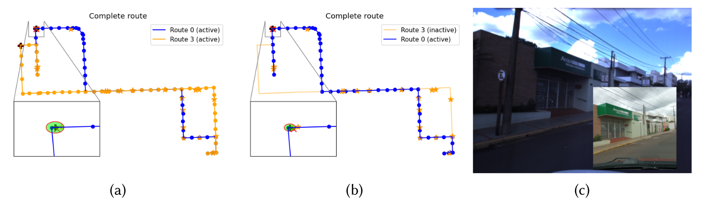
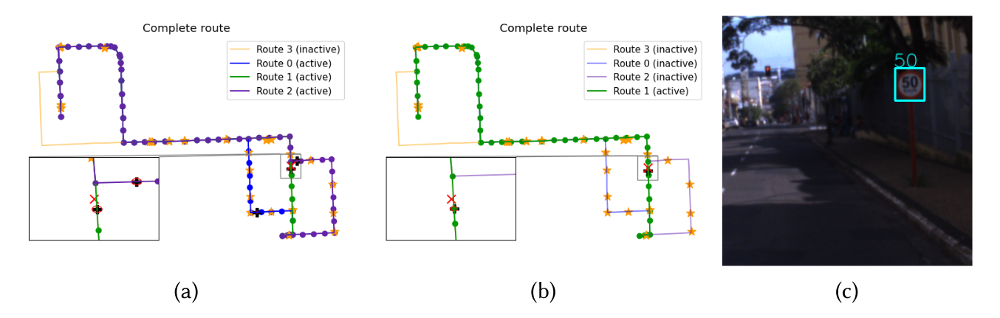

About
===========================================
This repository contains the source code and documentation of the method proposed in the paper **Digital map-based localization for autonomous vehicles with route uncertainty management** submitted to the Journal of Field Robotics in February, 2021.

In this project, we propose performing global localization for autonomous vehicles using odometry and coarse digital maps. Two types of features are used for the proposed localization method: landmarks and segment features.

Disclaimer: the Python implementation of the sign detection module was adapted from [this Ultralytics repository](https://github.com/ultralytics/yolov3) and the weights and network configuration files were used from the repository of [Martí Sánchez Juanola](https://github.com/martisaju/CARLA-Speed-Traffic-Sign-Detection-Using-Yolo).

Material
=================================================
Data were collected using the intelligent vehicle CARINA II from the *Laboratório de Robótica Móvel* (Universidade de São Paulo, campus São Carlos - Brazil).

The **collected data** (`csv` files for sensor data and `png` for image files) are available in this [link](https://drive.google.com/drive/folders/1pnjCgqEUxmjd9P2vzDNRHFrOtVp1vmHw?usp=sharing). Be aware that the data might be split into two different `zip` files.

Instead of the raw data, if you are interested on the complete data in ROS ([Robot Operating System](https://www.ros.org/)) format, the ROS `bag` files are available [here](https://drive.google.com/drive/folders/18giw-eH9R1P60MwpYXnx0eQDewSdhfDw?usp=sharing). However, the project in this repository does not support ROS **yet**.

The **map** used for the experiments (which contains landmark positions, branches and more) are available in this [link](https://drive.google.com/drive/folders/1Y8i5SaVC1KsOmFsevDwAwse4eniqsHLp?usp=sharing).

How to run the demonstration
=====================================

**Setup**: clone this repository to your workspace and download the Python (this is a Python 3 project!) packages required for running this project. An option is to create an Anaconda environment using `conda env create --file=environment.yml`. All the packages required are enumerated in `environment.yml`.

**First step**: download the dataset and the map on the repository links described above;

**Second step**: in the map directory, for each branch file contained in `routes/`, replace every occurence of `/absolute/path/to` to the absolute path to the root directory of the map. Usually the shortcut `CTRL+H` is an available option for most text editors.

**Third step**: in the map directory, for each file contained in `landmarks/files/` replace every occurrence of `/absolute/path/to` to the absolute path to the root directory of the map. (Yes, we know, this is a cumbersome step and we are working on improvements).

**Fourth step**: in the dataset directory, replace in the file `images.csv` every occurrence of `/absolute/path/to` to the absolute path to the directory where the data are contained.

**Fifth step**: in the root of the code repository, edit the `demo_config.yaml` file and replace every occurrence of `/absolute/path/to/map` to the absolute path of the directory where the map (landmark and route files) is contained; and replace every occurrence of `/absolute/path/to/data` to the absolute path of the `csv` files' directory.

**Sixth step**: in `modules/perception/sign_detection/detection.py`, replace `/absolute/path/to/repository` to the absolute path to the root directory of this repository.

**After doing all these steps**, hit `python run.py demo_config.yaml` in the root directory of the downloaded repository.

Running on different data
=====================================
If you are not interested in running this method on other datasets, there is no need to read the following lines and sections of this document.

However, if you are interested in running this method on other datasets, either for benchmarking or for proposing improvements, you will have to delve further into the modules contained in this repository.

The files contained in the `modules` folder are organized in a way that the proposed filter can be employed on different projects. They are organized in the following directories:
* `demo`: Contains the modules used for running the `run.py` demo. Not essential for using on other projects, but can be used for basis of how to use the other modules on a project.
* `filter`: Filter-related modules.
* `map`: Modules that interface the map.
* `perception`: Modules for speed limit sign detection and landmark matching. Feel free to change to other methods.

Each module has its own `readme.md` file for the sake of clearness, so the methods are better described. 

Understanding the Configuration file
================================
A configuration file is required for running the demonstration using `python run.py /path/to/config.yaml`. In case you are interested in changing any parameters, you can edit the `demo_config.yaml` changing the following fields:

* `dataset` (OPTIONAL):
    - `ignore_before_timestamp` (OPTIONAL): Set the minimum timestamp to start from data (in nanosec). Skips everything before that.
* `visualization`:
    - `skip_n_iters`: Instead of updating the figures on every iteration, skips N defined iterations.
    - `zoom_radius`: Defines the region around the groundtruth in meters.
* `filter`:
    - `prune_threshold`: When there are multiple active - possible - routes, this threshold indicates how much the weight of a hypotheis must be so it can be removed from the hypothesis list.
    - `initial_position`: An initial position estimation on the one-dimensional route in meters.
    - `initial_variance`: The variance of the initial position distribution in meters^2.
* `sensor`:
    - `msgs`:
        * `groundtruth` : The path to the csv file containing the groundtruth (in latitude, longitude coordinates). Header must be provided: `timestamp,latitude,longitude,altitude`.
        * `odometer` : The path to the csv file containing the odometer measurements. **Must be the transform of the current frame with respect to the previous frame**. Header must be provided: `timestamp,x,y,z,row,pitch,yaw`. 
        * `image` : The path to the csv file containing the images timestamp and their path. Header must be provided: `timestamp,path`.
        * `compass`: The path to the csv file containing the orientation measurements. 0 rad must point east. Header must be provided: `timestamp,roll,pitch,yaw,qx,qy,qz,qw`.
    - `settings`:
        * `landmark_matching_threshold`: How similar must the image descriptors be so that a match can be considered. Values in `[0,1]`.
        * `landmark_matching_sensitivity`: The landmark matching model sensitivity. Values in `[0,1]`
        * `landmark_matching_fpr`: The landmark matching false positive rate. Values in `[0,1]`
        * `sign_recognition_threshold`: How certain must the recognition be for considering a true measurement. Values in `[0,1]`
        * `sign_recognition_sensitivity`: The sign recognition model sensitivity. Values in `[0,1]`.
        * `sign_recognition_fpr`: The sign recognition model false positive rate. Values in `[0,1]`.
        * `compass_yaw_variance`: The variance of the yaw measurements from the compass.
        * `matcher`: The model used for matching. Values: "vgg16", "vgg19".
* `map`:
    - `branch1`: A latitude,longitude and route_idx tuple from where the first branch can be detected and which route it expands.
    - `branch2`: A latitude,longitude and route_idx tuple from where the second branch can be detected and which route it expands.
    - ...
    - `branchL`: A latitude,longitude tuple from where the L-th branch can be detected and which route it expands.
    - `route0`: Path to the initial planed route yaml file.
    - ...
    `routeK`: Path to the K-eth possible route - explored after its branching position is close to the estimation.

Map Files Required
=================================================
The map, in this project, consists of the ways of each of the routes and potential landmarks. Therefore, YAML files describing each of the routes' ways and each of the landmarks are required.

* **Landmark files' fields**
    * `name`: a name for that particular node (OPTIONAL);
    * `id`: the id of the node;
    * `lat`: the latitude;
    * `lon`: the longitude;
    * `timestamp`: date in str format of the last edit;
    * `path`: path to the image file of the landmark (each landmark must have an image).

* **Route files' fields**
    * `landmarks`: itemize all landmark files contained in the route.
    * `ways`:
        * `0`:
            * ...
        * `1`:
            * ...
        * ...
        * `i-th way of the sequence`:
            * `uid`: unique way identification number;
            * `p_init`: a tuple containing the latitude and longitude of the first point;
            * `p_end`: a tuple containing the latitude and longitude of the second point;
            * `maxspeed`: the way of the speed (the unit must be consistent with the signs to be detected - e.g. either both are in kmph or mph);
            * `street_id`: the identification of the street in which the way is contained;
            * `oneway` (OPTIONAL): boolean value that defines whether it is a one way street (`true`) or not (`false`).
        * `...`

Long-term TODO-list
============================
* Integrate with OpenStreetMap API so that the map can be retrieved directly from there;
* C++ implementation
* ROS integration
